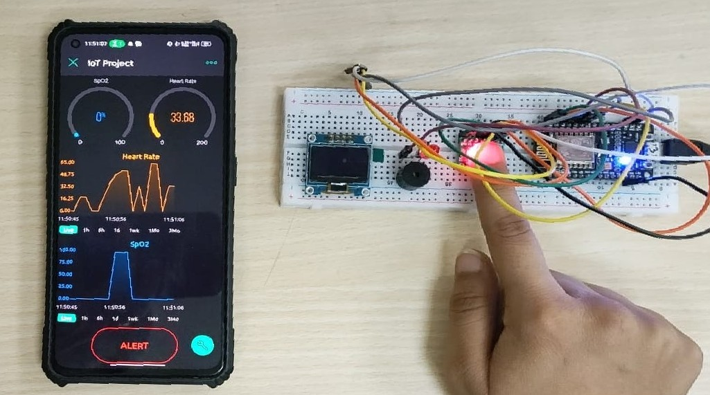

# IoT-based Health Monitoring System

## Project Overview
The IoT-based Health Monitoring System is designed to enhance healthcare services by providing continuous, real-time monitoring of vital health parameters. Utilizing the NodeMCU ESP8266 and the MAX30100 sensor, this system facilitates the measurement of SpO2 and heart rate, transmitting data to the Blynk app for easy access by both patients and healthcare providers.

## Features
- **Real-Time Health Monitoring**: Continuous tracking of SpO2 and heart rate.
- **Alert Mechanisms**: Immediate alerts via buzzer and LEDs for critical values.
- **Remote Access**: Health data accessible globally through the Blynk app.
- **Cloud Integration**: Secure and continuous data logging to ThingSpeak for analysis.
- **User-Friendly Interface**: Easy-to-navigate Blynk app for both patients and healthcare providers.

## Hardware and Software Requirements
### Hardware
- NodeMCU ESP8266
- MAX30100 Pulse Oximeter and Heart-Rate Sensor
- Buzzer
- LEDs
- Miscellaneous: Breadboard, Jumper Wires

### Software
- Arduino IDE
- Blynk App
- Libraries: Blynk, ESP8266WiFi, Adafruit_GFX, MAX30100_PulseOximeter

## Installation and Setup
### Hardware Setup
1. Connect the MAX30100 sensor to the NodeMCU according to the provided hardware diagram.
2. Attach the buzzer and LEDs to the designated pins on the NodeMCU.
3. Ensure all connections are secure on the breadboard.

### Software Configuration
1. **Arduino IDE Setup**:
   - Install the latest version of Arduino IDE.
   - Install the necessary libraries through the Library Manager (`Sketch` > `Include Library` > `Manage Libraries...`).
2. **Blynk App Configuration**:
   - Download the Blynk app and create a new project.
   - Note the `BLYNK_AUTH_TOKEN` and update it in your Arduino sketch.
3. **Loading the Sketch**:
   - Open the provided `.cpp` file in Arduino IDE.
   - Replace `ssid` and `pass` with your Wi-Fi credentials.
   - Upload the sketch to your NodeMCU.

## Usage
1. Open the Blynk app and run the project.
2. The system will begin monitoring SpO2 and heart rate values in real-time.
3. Alerts will be triggered on the device and through the app if critical values are detected.

## System Overview

## Contributors

- **Anay Sinhal** - [View Profile](https://github.com/anayy09)
- **Chitraksh Gupta** - [View Profile](https://github.com/ChitrakshGupta)
- **Kanchi Sharma** - [View Profile](https://github.com/KanchiSharma13)

## Contributing
We welcome contributions to improve the IoT-based Health Monitoring System. Whether it's feature requests, bug reports, or code contributions, please feel free to make a pull request or open an issue.
